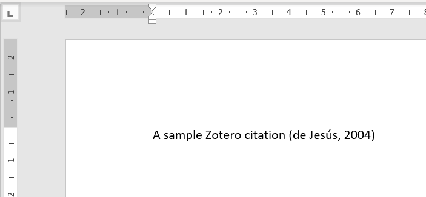
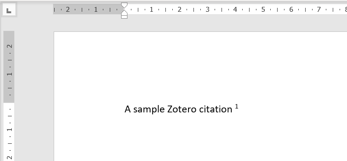
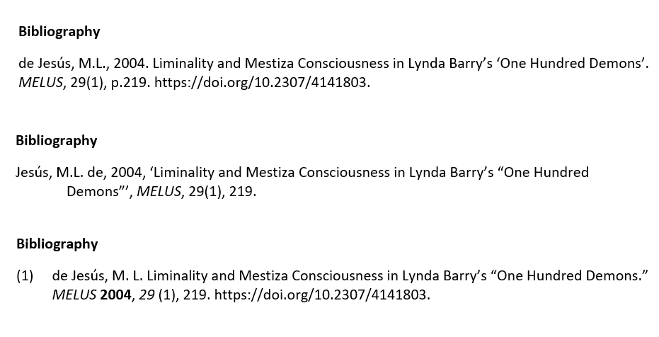

# Citation Management

Citation management tools are a valuable resource for researchers. They can help you capture and organise resources during the research process, and manage in-text citations and bibliographies when writing up.

## RefWorks

All staff and students have access to RefWorks. Log in from the [RefWorks homepage](https://refworks.proquest.com/) by following the **Use login from my institution** button.

RefWorks is primarily an online service where your reference library is managed in your browser.

### Saving items in RefWorks

There are several ways to save an item to your RefWorks library:

- Drag a PDF into the RefWorks window
- Use the [Save to RefWorks](https://refworks.proquest.com/tools/) bookmark to add an item from a web page
- Look for a **Save / Export to RefWorks** link when using an online database
- Import details from a database or another citation tool using the BibTeX or RIS formats
- Add an item manually using the **Add** button

### RefWorks and Word

You can also install the [RefWorks Citation Manager](https://refworks.proquest.com/tools/) to use your RefWorks library in Word.

### RefWorks Help &amp; support

The library has a [guide to RefWorks features](https://libguides.northampton.ac.uk/refworks). Official support is available from the [RefWorks Knowledge Centre](https://knowledge.exlibrisgroup.com/refworks).

## Zotero

[Zotero](https://www.zotero.org/) is an open-source reference manager with a number of useful features and plugins. Although you can use Zotero in your browser, it also offers a desktop app for local / offline access.

You can download and use the [desktop app](https://www.zotero.org/download) without creating a Zotero account. To enable cloud storage of your library and access to the web library features, you'll need to create a [free personal account](https://www.zotero.org/user/register).

### Saving items in Zotero

There are several ways to save items to your library:

- Drag a PDF into the Zotero desktop app, or the web library
- Use the [Zotero Connector](https://www.zotero.org/download/) to save items from your browser
- Use the magic wand icon to add an item using an identifier such as a DOI or ISBN
- Import from RIS, BibTeX and other export formats
- Manually enter item details in the desktop or web apps

### Zotero &amp; Word

The [Zotero plugin for Word](https://www.zotero.org/support/word_processor_plugin_usage) is installed along with the desktop app, enabling you to create and manage in-text citations and bibliographies.

<figure markdown>
  { width="640px" }
  <figcaption>Selecting an item from the Zotero library.</figcaption>
</figure>

{ width="640px" }

*The citation is added using your selected style.*

{ width="640px" }

*Citation style can be changed at any time throughout your document.*

{ width="640px"}

*Zotero allows you change bibliography styles at any stage.*

### Zotero Help &amp; support

The [online help](https://www.zotero.org/support/) has guides on all aspects of using Zotero.

## Mendeley

[Mendeley](https://www.mendeley.com/search/) is a free reference management tool offered by Elsevier. You'll need to create an account to use Mendeley.

!!! warning "Versions of Mendeley"
    Mendeley currently offers two versions of its desktop app. [Mendeley Desktop](https://www.mendeley.com/reference-management/mendeley-desktop) is the classic or "legacy" version, and [Mendeley Reference Manager](https://www.mendeley.com/download-reference-manager/) is the modern version, with an interface that matches the web library, though it currently lacks several features from the classic app. Which one you need can depend on your operating system version - and there are similar factors affecting the Word plugin.

    Mendeley also offers a [web importer](https://www.mendeley.com/reference-management/web-importer) tool for browsers, and a [Word plugin](https://www.mendeley.com/reference-management/mendeley-cite) for creating citations and bilbiographies.
