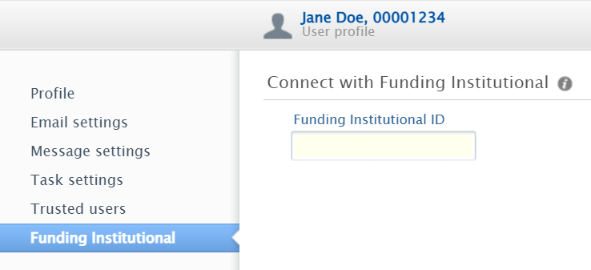

# Funding Institutional

Funding Institutional combines over 18,000 active funding opportunities with information on over 6.3 million awarded research grants from a wide-range of funders.

Search easily for active, accurate funding opportunities in a timely manner from over 4,300 government and private funding organizations, and by offering insight into research that has already been funded in your area of interest.

Funding Institutional is integrated into Pure so that you can access opportunities from Pure or Funding Institutional directly and easily share opportunities with colleagues.

## Logging in

From [https://www.fundinginstitutional.com/](https://www.fundinginstitutional.com/), click **Sign in** and then select **Sign in via your institution**. Enter your university email, click **Continue** and follow the prompts to sign in using the standard University single sign-on system.

After you've logged in once, you may find that the system remembers you and offers you a quick login link.

## Connecting with Pure

After logging into Funding Institutional, click on your initials in the top right and select **Account**.

At the bottom of the Account page you'll see a **Connect with Pure** header, followed by your ID number. Use the **Copy ID** link to copy your ID.

Log into Pure, click the account icon at the top of the dashboard, and select **Funding Institutional**.

{: style="width: 50%"}

Paste your ID into the **Funding Institutional ID** box and click **Save**.
