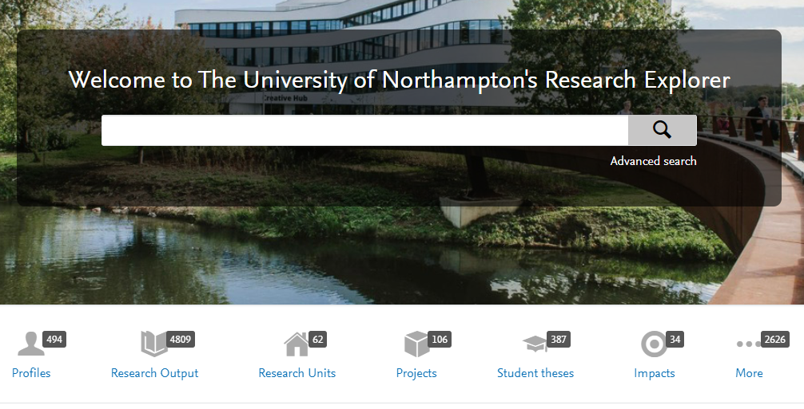
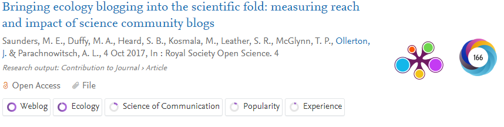

# Pure

[Pure](https://pure.northampton.ac.uk/) is the University of Northampton's current research information system and is also our portal to the world, showcasing the research outputs, projects, datasets and activities of our researchers.

## Pure for staff and students

Staff and graduate students with at least one published output have Pure profiles that highlight their research.

Contact [pure@northampton.ac.uk](mailto:pure@northampton.ac.uk) to arrange a Pure training session – initial training sessions take one hour.

## Pure features

Pure is a public platform that is available to anyone with internet access.

Research Outputs highlight keywords and links to Plum Analytics and Altmetric, showing the attention the research is receiving.  You can click through to find research outputs in subject areas, by faculty/department or by Pure profile.

Presentation of research staff when using the search function:

A full researcher profile:

An example of a research item returned by the search function:

## Putting your impact in Pure

The Pure impact section allows you to make research impact public. Let people know how your work is affecting, benefiting and changing the world. It can also serve as tool for other researchers through its links to your outputs, and help us internally as we prepare for the next REF cycle (and you don’t have to make everything public). It’s never too early to start tracking your impact in Pure.

> [!NOTE]
> If you’ve never used the impact section of Pure before, you might want to look at how to create an impact in the [Pure Handbook](https://www.yammer.com/northampton.ac.uk/#/files/172063681?version=174674105) first.  

- PURE **Impact** builds on the **outputs, activities** and **projects** that comprise your work, and asks you to articulate where your pathways to impact have led. It allows you to build an impact story, and communicate your research to wider audiences
- Remember, this is about the impact your research has had, not its potential or pathway to impact. Write your description in the third person, clearly identify the actual change your research has achieved and include evidence to back up your claims.
- Write for the general public (specialist audiences can always click on the linked research output for a more in-depth view)
- Pure is for an international audience, so spell out acronyms even if they seem obvious to you, i.e. the NHS
- Use keywords to create a clear and descriptive title. A good title should indicate what changed, a key stakeholder or stakeholders, and tell us where the impact took place
- When listing your beneficiaries, combine general categories with specific partners to optimise keyword searches, while also indicating the specific reach/significance of your impact.
- Describe the research findings that led to this impact. Before an impact is make public in Pure, it needs to link to a 2\* research output in the **relations** section of the profile
- Identify how the output directly and materially linked to the impact you are claiming. Why wouldn’t the impact have occurred, or how would it have been significantly reduced without this research?
- Make sure to back up your impact claims by uploading evidence to the evidence section. Upload your impact evidence so it’s ready for REF submission. Evidence doesn’t have to be made visible in the public platform, so you can upload testimonials or other documents you want to include, but don’t want made public.

## Award management in Pure

Pure Award Management is the University's award system which enables the Research and Innovation Funding Support team to track, monitor and manage bid-related activity. Integrated in Pure, the system allows academics and researchers to create applications for funding, obtain institutional approval and keep track of their applications.

Pure Award Management also captures post award by the creation of awards and projects for successful bids. Academics and researchers can store post award documentation, record and track time spent on a project and create milestones. Research activities (datasets, equipment, impact, outputs and papers) can be linked to the project.

Pure Award Management enables applications, awards and projects to be stored in one location making it an ideal one-stop source for your research.

For help on using the system, refer to the Pre-Award and Post-Award User Guides or [Email us](mailto:rifs@northampton.ac.uk) to arrange a one-hour training session.

- [Pre-Award User Guide](https://mypad.northampton.ac.uk/rifs/bidding-for-funding/pure-award-management-approval-process/)
- [Post Award User Guide](https://mypad.northampton.ac.uk/rifs/post-award-support/pure-award-management-creating-an-award-and-project/)

## Research impact in Pure

- You can track your [research impact](research-impact.md) on Pure. See the [Pure Handbook](https://www.yammer.com/northampton.ac.uk/#/files/172063681?version=174674105) for information on the technical details, and for tips on best practice take a look at the guide to putting your impact in Pure
- Impact is an important part of UK Research and Innovation Funding applications. Find out more about how the different research councils approach impact in the [impact funding guidelines](research-impact.md).

## Pure help &amp; support

- [Pure Award Management- Pre Award User Guide Version 0.4 (Opens in a new window)](https://libguides.northampton.ac.uk/ld.php?content_id=33223094)
- [Pure Award Management- Post Award User Guide Version 0.5 (Opens in a new window)](https://libguides.northampton.ac.uk/ld.php?content_id=33223127)

[Pure Handbook](https://www.yammer.com/northampton.ac.uk/#/files/172063681?version=174674105)

[Email to arrange Pure training](mailto:pure@northampton.ac.uk?subject=Training%20enquiry)

[Email for help on using the system](mailto:rifs@northampton.ac.uk)
