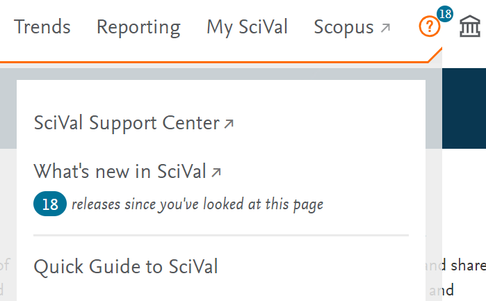

# SciVal

SciVal enables access to the research performance of over 14,000 research institutions from over 230 nations.

SciVal can be used to assess research performance, benchmark relative to peers, develop collaborative partnerships and analyse research trends.

Elsevier’s new generation of SciVal offers quick, easy access to the research performance of 4,600 research institutions and 220 countries worldwide. A ready-to-use solution with unparalleled power and flexibility, SciVal enable you to navigate the world of research and devise an optimal plan to drive and analyse your performance.

## Accessing SciVal

All staff and PGR students at the University of Northampton have access to SciVal. To log in, go to the [SciVal homepage](https://scival.com/), click **Sign In** and select **Sign in via your institution**. Enter your University email and follow the prompts to log in using the standard University single sign-in system.

You will then see a personal homepage. It shows:

- Overview:  a summary of a particular university, department or research group. You can look at University of Northampton or any other university, organisation or business.
- Benchmarking:  allows you to compare universities, organisations, businesses, departments and research groups
- Trends: investigate research topics in depth, investigate publications that reflect SDGs (Sustainable Development Goals).
- Reporting:  Create customised reports on metrics relation to research outputs

At the top of the screen you'll see a **?** link that leads to a number of useful guide and resources, including the Quick Guide to SciVal, which is recommended for new users:

{: style="width: 50%"}
